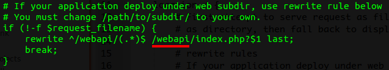
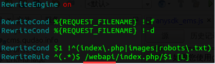

一、miniGameServer概述
===================
单机游戏服务端是用于单机游戏使用AnySDK时，能够方便地接入已有的渠道SDK。模拟AnySDK流程闭环中的游戏服务器，提供登陆验证转发、支付结果回调、订单状态查询等接口。单机游戏服务端本身不提供手机网游服务端的功能，只提供和AnySDK支付结果异步通知，用户登陆验证相关的功能。
适用范围
------
miniGameServer只适用于单机手机游戏在没有游戏服务器的情况下，想接入AnySDK提供的各个渠道的网游SDK的手机单机游戏，单机游戏服务端充当游戏服务器接收AnySDK服务器的支付充值结果的异步通知消息。

二、miniGameServer目录结构（基于 PHP CodeIgniter 框架，此处只说明不属于 CI 框架的文件）
============================================================

    application
      +-- config
      |     +-- settings.php            保存安装过程中填写的配置参数，需要写权限，使用过程中可手动修改错误的参数
      +-- controllers
      |     +-- api                     接口相关的控制器
      |     |     +-- payment.php           接收支付通知接口，订单查询接口
      |     |     +-- user.php              登录验证转发接口
      |     +-- install.php             安装程序
      +-- core
      |     +-- MY_Controller.php       预留的控制器父类
      |     +-- MY_Model.php            预留的模型父类
      +-- helpers
      |     +-- options_helper.php      选项辅助函数
      +-- libraries
      |     +-- http_request.php        http请求库
      +-- models
      |     +-- options_mdl.php         基于数据库的kv配置
      |     +-- pay_notify_mdl.php      支付通知接口日志记录
      +-- views
            +-- install                 安装程序页面视图文件

    web-conf
      +-- nginx.conf                    nginx配置示例

    .htaccess                           apache url 重写示例
    index.php
    robots.txt
    license.txt

三、运行环境需求
==============
    PHP 版本 5.1.6 或更新；要求安装curl，mysql扩展
    当前支持的数据库为：MySQL 4.1 +

四、更新说明
=========
如果您使用git clone的方式部署代码到您的生产环境，更新的时候请记得备份您的 /path/to/application/config/settings.php 文件。

五、安装miniGameServer
================
5.1、将代码上传到服务器
------------------

**nginx**

代码需要上传到web服务器的根目录，如果web服务器是nginx，可以参照代码目录中的web-conf/nginx.conf来配置nginx的虚拟主机。

假设以 /var/www/html/mobgame 为web根目录，将项目代码上传到此目录下，项目的index.php的路径应为 /var/www/html/mobgame/index.php ，此时nginx虚拟主机的urlrewrite规则为：

假设程序不是上传到nginx虚拟主机的根目录，则需要修改nginx配置文件的url rewrite规则。例如：以 /var/www/html/mobgame 为web根目录，代码放在/var/www/html/mobgame/webapi/目录下（则index.php的路径为 /var/www/html/mobgame/webapi/index.php），则使用如下urlrewrite规则：

**apache**

假设web服务器是apache，以 /var/www/html/mobgame 为web根目录，程序不是上传到apache虚拟主机的web根目录，则需要修改程序目录下的.htaccess文件。为了使UrlRewrite配置生效，您可能需要将apache配置文件中对应目录或者对应虚拟主机的`AllowOverride`从`None`改为`All`。

例如，代码放在/var/www/html/mobgame/webapi/目录下，则index.php的路径为 /var/www/html/mobgame/webapi/index.php，参照下图修改程序目录下的.htaccess文件：

5.2、安装MySQL，并创建数据库
-----------------------
单机游戏服务器端需要使用MySQL数据库，您需要在服务器上安装MySQL，并创建数据库，记录下MySQL的主机地址，用户名和密码（不能为空），创建好的数据库名，接下来的安装过程会需要这些参数。

5.3、执行安装程序
--------------
打开浏览器，访问 http://{url:port}/\[path/to/\]install 进行安装。

**其中：**

{url:port｝表示nginx虚拟主机的访问地址，即域名或ip地址（推荐使用ip地址，域名有被劫持的危险），若端口不是默认的80，则还需要加上端口号；

[path/to/] 表示相对于web根目录的子目录，以5.1的/var/www/html/mobgame 下的子目录 webapi为例，则地址是 http://{url:port}/webapi/install

**注意：**若安装过程中出现为配置文件（/path/to/application/config/settings.php）赋予写权限失败的情况，请检查是否是SELinux限制了PHP的读写权限。

六、接口使用
===========

6.1、登陆转发接口 api/user/login (单机游戏调用)
--------------------------------------
接口完整地址（仅为示例）：

    http://{url:port}/api/user/login
    
或者:

    http://{url:port}/webapi/api/user/login
    
参考AnySDK文档：http://docs.anysdk.com/OauthLogin

6.2、支付结果回调 api/payment/callback (AnySDK 服务端调用)
-------------------------------------------------
接口完整地址（仅为示例）：

    http://{url:port}/api/payment/callback
    
或者：

    http://{url:port}/webapi/api/payment/callback

参考AnySDK文档：http://docs.anysdk.com/PaymentNotice

6.3、查询订单支付结果 api/payment/check_order (单机游戏调用)
--------------------------------------------------

接口完整地址：http://{url:port}/api/payment/check_order

调用角色：单机游戏

请求方式：HTTP  POST

请求参数：

<table style="border:1px solid #bfbfbf;text-align:left;">
    <tr>
        <th width="100px">参数名</th>
        <th width="75px">类型</th>
        <th width="400px">说明</th>
    </tr>
    <tr>
        <td>order_id</td>
        <td>String</td>
        <td>订单号</td>
    </tr>
    <tr>
        <td>time</td>
        <td>String</td>
        <td>时间， yyyy-mm-dd HH:ii:ss 如: 2014-08-05 09:05:07</td>
    </tr>
    <tr>
        <td>ver</td>
        <td>Int</td>
        <td>版本号: 按照此文档接入的固定为1</td>
    </tr>
    <tr>
        <td>app_key</td>
        <td>String</td>
        <td>安装的时候生成的app_key参数</td>
    </tr>
    <tr>
        <td>sign</td>
        <td>String</td>
        <td>签名，Md5(app_key+order_id+time)</td>
    </tr>
</table>

返回格式：json

返回参数：

<table style="border:1px solid #bfbfbf;text-align:left;">
    <tr>
        <th width="100px">参数名</th>
        <th width="75px">作用</th>
        <th width="400px">说明</th>
    </tr>
    <tr>
        <td>errno</td>
        <td>错误码</td>
        <td>0 表示查询成功, 其他表示查询失败, 这个状态不代表订单状态, 详情见 附录C</td>
    </tr>
    <tr>
        <td>time</td>
        <td>String</td>
        <td>时间， yyyy-mm-dd HH:ii:ss 如: 2014-08-05 09:05:07</td>
    </tr>
    <tr>
        <td>errmsg</td>
        <td>错误描述</td>
        <td></td>
    </tr>
    <tr>
        <td>data</td>
        <td>订单数据</td>
        <td>安装的时候生成的app_key参数</td>
    </tr>
    <tr>
        <td>sign</td>
        <td>签名</td>
        <td>订单信息签名；为了保证订单信息的真实性，请对服务器返回的订单信息做sign验证。详情请参考附录B</td>
    </tr>
</table>

data参数解析：

<table style="border:1px solid #bfbfbf;text-align:left;">
    <tr>
        <th width="100px">参数名</th>
        <th width="75px">类型</th>
        <th width="400px">说明</th>
    </tr>
    <tr>
        <td>order_id</td>
        <td>String</td>
        <td>订单号</td>
    </tr>
    <tr>
        <td>product_count</td>
        <td>String</td>
        <td>要购买的商品数量</td>
    </tr>
    <tr>
        <td>amout</td>
        <td>String</td>
        <td>支付金额，单位元</td>
    </tr>
    <tr>
        <td>pay_status</td>
        <td>String</td>
        <td>支付状态，1为成功，2为失败</td>
    </tr>
    <tr>
        <td>pay_time</td>
        <td>String</td>
        <td>支付时间，YYYY-mm-dd HH:ii:ss</td>
    </tr>
    <tr>
        <td>order_type</td>
        <td>String</td>
        <td>支付方式</td>
    </tr>
    <tr>
        <td>source</td>
        <td>String</td>
        <td>渠道服务器通知 AnySDK 时请求的参数</td>
    </tr>
    <tr>
        <td>user_id</td>
        <td>String</td>
        <td>用户id，用户系统的用户id</td>
    </tr>
    <tr>
        <td>game_user_id</td>
        <td>String</td>
        <td>游戏内用户Id，支付时传入的Role_id</td>
    </tr>
    <tr>
        <td>game_id</td>
        <td>String</td>
        <td>游戏id</td>
    </tr>
    <tr>
        <td>server_id</td>
        <td>String</td>
        <td>服务器id，支付时传入的server_id</td>
    </tr>
    <tr>
        <td>product_id</td>
        <td>String</td>
        <td>商品id，支付时传入的product_id</td>
    </tr>
    <tr>
        <td>product_name</td>
        <td>String</td>
        <td>商品名称product_name,支付时传入的product_name</td>
    </tr>
    <tr>
        <td>private_data</td>
        <td>String</td>
        <td>自定义参数，支付时传入的EXT参数</td>
    </tr>
    <tr>
        <td>channel_number</td>
        <td>String</td>
        <td>渠道编号</td>
    </tr>
</table>

返回示例：

成功返回示例：

失败返回示例：

6.4、接口的使用方式
---------------

6.1和6.2的接口只需将相应的接口填写到AnySDK打包工具客户端-参数配置界面响应的输入框内。示例如下：

附录A：查询订单签名算法
==================

    Md5(app_key+order_id+time) 不包含+号

附录B：验证订单合法性 - 签名算法
=========================
此处需要使用到的app_secret是安装过程第三步的时候生成的app_secret。
将接收到的参数的data部分内容，按key的字典序进行排序，然后将值value串接成字符串，加上app_secret再计算字符串的md5值，sign值不区分大小写，全部用小写字母。
例如：
原始的数据为

    data[‘b’] = 2
    data[‘c’] = 3
    data[‘a’] = 1

按字典序排序后

    data[‘a’] = 1
    data[‘b’] = 2
    data[‘c’] = 3

拼接后得到字符串：

    sign_str = ‘123’

计算md5：

    md5(sign_str+app_secret)  #不包含+号

计算得到的md5和接收到的sign值进行对比

附录C：错误码
==========

<table style="border:1px solid #bfbfbf;text-align:left;">
    <tr>
        <th width="100px">错误码</th>
        <th width="75px">错误描述</th>
    </tr>
    <tr>
        <td>0</td>
        <td>查询成功</td>
    </tr>
    <tr>
        <td>100</td>
        <td>订单不存在</td>
    </tr>
    <tr>
        <td>101</td>
        <td>order_id不能为空</td>
    </tr>
    <tr>
        <td>102</td>
        <td>时间超时</td>
    </tr>
    <tr>
        <td>103</td>
        <td>缺少签名sign</td>
    </tr>
    <tr>
        <td>104</td>
        <td>app_key无效</td>
    </tr>
    <tr>
        <td>105</td>
        <td>签名sign无效</td>
    </tr>
</table>
